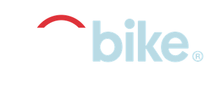

{style="float:left;position:absolute;top:0px;margin-top:5px" width="165"}

## Business Introduction

### Business Processes and Data Flow

### Data Visualisation as a tool for decision-making

### Data Types

### Data Quality and Data Bias

## Data Cleaning

## Data Visualisations & Insights

### Hires Per Month

::: plot_analysis
{style="float:left; margin: 5px 20px 20px 0px" width="55"}

It is expected that the weather conditions will have an impact on the demand for the service. The demand is higher in the warmer months, which are spring and summer. This information is useful for determining the provisioning strategy. It may be necessary to have fewer bikes available on the streets during the months with less demand in order to prevent bike damage.
:::

### Hires Per Month By Gender

::: plot_analysis
{style="float:left;margin:5px 20px 3px 0px" width="46" height="49"}

There are more men than women who use the Citi bike service. Targeted marketing strategies and advertisements tailored to different genders could be effective in increasing the number of woman users.
:::

### Hires Per Each Week Day By Customer Type

::: plot_analysis
The majority of users are subscribers, and weekdays have more traffic on workdays (Monday to Friday). However, on weekends, customers are the higher users.

It is likely that the workday users are people who commute to work. Therefore, it would be beneficial to offer customized services to make them feel more secure, such as insurance. Additionally, this could attract new users to the service.
:::

### Travels Frequency

::: plot_analysis
{style="float:left;margin:5px 20px 10px 0px" width="47"}

The most popular travel route, start station to end station, is from 3202 to station 3186. To improve the cycling experience, it is suggested to strengthen the bicycle maintenance team in areas with higher utilization. It is equally important to increase marketing efforts in areas with fewer travels to attract more users.
:::

### Bikes with Most and Less Utilization

```{r}

```

### Start Stations Location

```{r}

```
