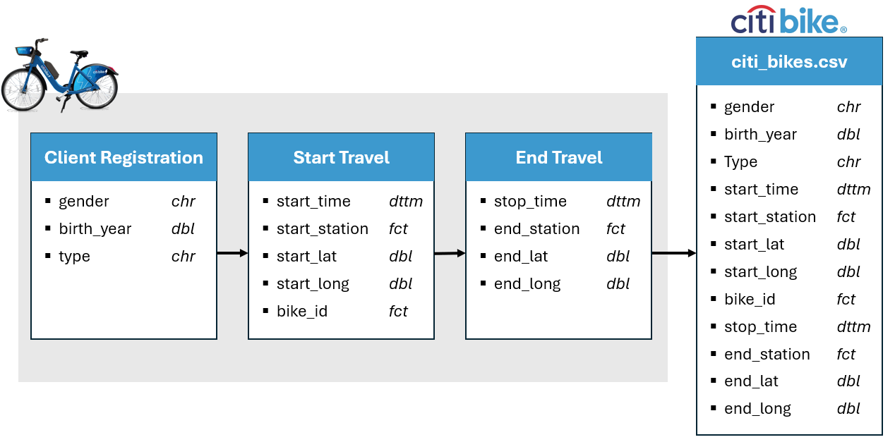

{style="float:left;position:absolute;top:0px;margin-top:15px" width="164" height="41"}

## Business Introduction

<hr>

### Business Processes and Data Flow



<hr>

### Data Visualisation as a tool for decision-making

<hr>

### Data Types

### Data Quality and Data Bias

```{r message=FALSE, warning=FALSE, include=FALSE}
df <- source("../01_data_clean_script/citi_bikes_clean_script.R", local = TRUE)$value

df <- df %>% 
  filter(gender %in% c("Male", "Female")) %>% 
  index_by(month) %>% 
  group_by(month, gender) %>% 
  select(gender) %>% 
  summarise(nr = n())

rr <- read_csv("../02_data_cleaned/nyc_bikes_clean")

rr %>% 
  select(gender) %>% 
  filter(gender %in% c("Female", "Male")) %>% 
  group_by(gender) %>% 
  summarise(count = n()) %>% 
  arrange(desc(gender)) %>% 
  kable( col.names = c("Gender", "Count"), align = "c" , caption = "Total Amount of gender sample") %>% 
  kable_styling(full_width = FALSE, position = "center", bootstrap_options = c("basic"))
```

## Data Cleaning

## Data Visualisations & Insights

<hr>

### Hires Per Month

::: plot_analysis
This line graph shows the tend of total users per each month of the year of 2018. The months that have more demand are the warmer months, it means during the spring and the summer, the weather conditions could influence the number of users of bikes.

The relation between the number of users per each month (or seasons) could helps to know the trend of users for eventually make less or more bikes available depending on the time of year, if there are less demand should have less bikes available in streets to the bikes don't get damaged.
:::

::: exp
<p>ok ok ok</p>
:::

### Hires Per Month By Gender

<hr>

### Hires Per Each Week Day By Customer Type

<hr>

### Travels Frequency

<hr>

### Start Stations Location
