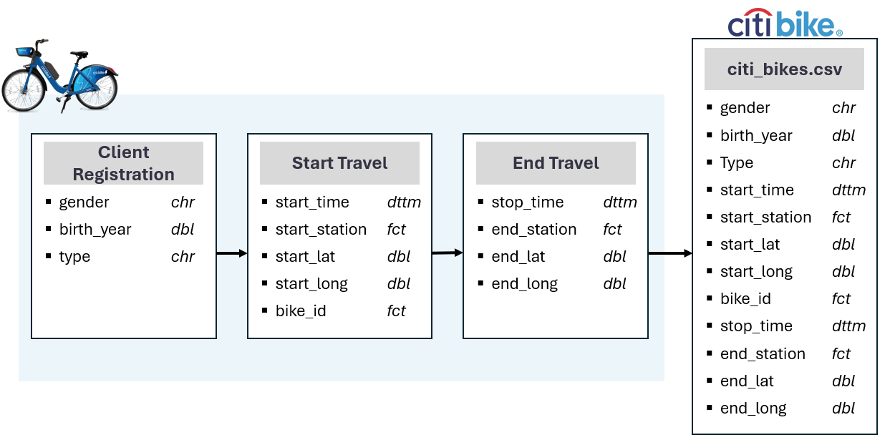

```{r message=FALSE, warning=FALSE, include=FALSE}
library(IRdisplay)
library(htmltools)
library(gridExtra)
library(tidyverse)
library(janitor)
library(DT)
```

```{r message=FALSE, warning=FALSE, include=FALSE}

title_and_header_dir    <- "www/title_and_header.html"
decision_making_dir     <- "www/decision_making.html"
data_quality_dir        <- "www/data_quality.html"
data_types_dir          <- "www/data_types.html"
data_cleaning_dir       <- "www/data_cleaning.html"
data_visualisations_dir <- "www/data_visualisations.html"

hires_per_month_outcome_dir <- "www/hires_per_month_outcome.html"
hires_per_month_gender_outcome_dir <- "www/hires_per_month_gender_outcome.html"
week_day_outcome_dir <- "www/week_day_outcome.html"
journey_outcome_dir <- "www/journey_outcome.html"
start_station_outcome_dir <- "www/start_station_outcome.html"
end_station_outcome_dir <- "www/end_station_outcome.html"
```

```{r warning=FALSE, echo=FALSE, message=FALSE}

title_and_header <- readLines(title_and_header_dir, warn = FALSE)
HTML(paste(title_and_header, collapse = "\n"))
```

## 1. Business Process and Data Flow



## 2. Decision-Making

```{r warning=FALSE, echo=FALSE, message=FALSE}

decision_making <- readLines(decision_making_dir, warn = FALSE)
HTML(paste(decision_making, collapse = "\n"))
```

## 3. Data Quality and Bias

```{r warning=FALSE, echo=FALSE, message=FALSE}

data_quality <- readLines(data_quality_dir, warn = FALSE)
HTML(paste(data_quality, collapse = "\n"))
```

## 4. Data Types
```{r warning=FALSE, echo=FALSE, message=FALSE}

data_types <- readLines(data_types_dir, warn = FALSE)
HTML(paste(data_types, collapse = "\n"))

df <- read_csv("02_data_cleaned/nyc_bikes_clean.csv")

variables_info <- data.frame(
  sapply(df,class)
  )[1, ]

variables_info

```

## 5. Data Cleaning
```{r warning=FALSE, echo=FALSE, message=FALSE}

data_cleaning <- readLines(data_cleaning_dir, warn = FALSE)
HTML(paste(data_cleaning, collapse = "\n"))
```

## 6. Data Visualisations & Insights

```{r warning=FALSE, echo=FALSE, message=FALSE}

data_visualisations <- readLines(data_visualisations_dir, warn = FALSE)
HTML(paste(data_visualisations, collapse = "\n"))
```

### Hires per month

```{r warning=FALSE, echo=FALSE, message=FALSE, out.width="100%"}
hires_per_month_outcome <- readLines(hires_per_month_outcome_dir, warn = FALSE)
HTML(paste(hires_per_month_outcome, collapse = "\n"))

source(here::here("03_visualisations/bikes_hired_per_month.R"), local = TRUE)$value
```

### Hires Per Month By Gender

```{r warning=FALSE, echo=FALSE, message=FALSE, out.width="100%"}

hires_per_month_gender_outcome <- readLines(hires_per_month_gender_outcome_dir, warn = FALSE)
HTML(paste(hires_per_month_gender_outcome, collapse = "\n"))

source(here::here("03_visualisations/bikes_hired_by_gender.R"), local = TRUE)$value
```

### Hires Per Weekday by Type of Customer

```{r warning=FALSE, echo=FALSE, message=FALSE, out.width="100%"}

week_day_outcome <- readLines(week_day_outcome_dir, warn = FALSE)
HTML(paste(week_day_outcome, collapse = "\n"))

source(here::here("03_visualisations/bikes_hired_per_weekday_by_customer.R"), local = TRUE)$value
```

### Most Frequent Journey

```{r warning=FALSE, echo=FALSE, message=FALSE, out.width="100%"}

journey_outcome <- readLines(journey_outcome_dir, warn = FALSE)
HTML(paste(journey_outcome, collapse = "\n"))

source(here::here("03_visualisations/travels_frequency.R"), local = TRUE)$value
```

### Start Stations Locations
```{r warning=FALSE, echo=FALSE, message=FALSE, out.width="100%"}

start_station_outcome <- readLines(start_station_outcome_dir, warn = FALSE)
HTML(paste(start_station_outcome, collapse = "\n"))


source(here::here("03_visualisations/start_stations_map.R"), local = TRUE)$value

```

### End Stations Locations

```{r warning=FALSE, echo=FALSE, message=FALSE, out.width="100%"}


end_station_outcome <- readLines(end_station_outcome_dir, warn = FALSE)
HTML(paste(end_station_outcome, collapse = "\n"))


source(here::here("03_visualisations/end_stations_map.R"), local = TRUE)$value
```
