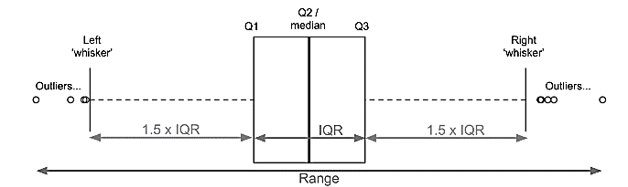
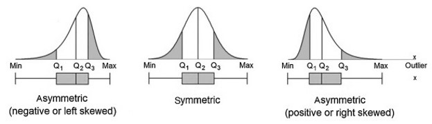

```{r message=FALSE, warning=FALSE, include=FALSE}
source(file = here::here("libraries.R"))
```

```{r message=FALSE, warning=FALSE, include=FALSE}
penguins <- palmerpenguins::penguins %>% 
  janitor::clean_names()
```

{style="float:left;position:absolute;top:0px;margin-top:10px" width="250"}

## Exploratory Analysis

```{r warning=FALSE, echo=FALSE, message=FALSE}
variables_info <- data.frame(
  sapply(penguins,class)
  )

# Move rownames for a variable called 'variable';
# Rownames numerated from 1 to nr of rows
variables_info$variable <- rownames(variables_info)
rownames(variables_info) <- 1:nrow(variables_info)
variables_info <- variables_info %>% relocate(variable)

variables_info$type <- variables_info$sapply.penguins..class.


variables_info <- variables_info %>% 
  select(variable, type) %>% 
  arrange(type)


group_style <- "background-color:red; color:white; text-align:center; vertical-align:middle;"


kable(
    x = variables_info,
    row.names = FALSE,
    col.names = c("Variable","Type"),
    align = "c"
  ) %>% 
  kable_styling(
    full_width = FALSE,
    position = "float_right",
    bootstrap_options = c("basic", "responsive")) %>% 
  # add_footnote(
  #   label = c("List of variable type"), 
  #   escape = FALSE,
  #   notation = "none") %>%
  row_spec(0, background = "none", color = "#333333") %>%
  row_spec(1:nrow(variables_info), extra_css = "border-bottom: 1px solid #DCEFFB;") %>% 
  pack_rows("Integer", 4, 6, label_row_css = group_style) %>%
  pack_rows("Factor", 1, 3, label_row_css = group_style) %>% 
  pack_rows("Numeric", 7, 8, label_row_css = group_style)
```

<p style="line-heigth:1.5; margin-right:300px">

We are interested in how **bill length** differ between the three species of penguin (Adelie, Chinstrap & Gentoo) of penguins. We will use the penguins dataset from the palmerpenguins package. The variables of the dataset are shown in the right table by type.

</p>

<br><br>

```{r  warning=FALSE, echo=FALSE, message=FALSE, out.width="100%"}
penguins %>% 
  group_by(species) %>% 
  skim(bill_length_mm) %>% 
  yank("numeric") 
```

<details class="collapse_theory">

<summary><b>Expand for Boxplot Interpretation Explanation</b></summary>

`<div class="`{=html}collapse_theory_content`">`{=html}

The central box corresponds to the interquartile range of data distribution (IQR). 50% of values falling in the IQR which is limited by Q1 to Q3. Values beyond the whiskers on both sides are normally considered outliers.



The bar inside the central box represents the median (Q2) and shows the data symmetry and skewness. Skewness is the distortion or asymmetry in a normal distribution.

-   **Symmetric distribution:** the median is in the middle of the box, and the lengths of the whiskers are about the same on both sides;

-   **Distribution is positively skewed (skewed right)**: the median is closer to the bottom of the box (Q1), and the whisker is shorter on the lower end of the box.

-   **Distribution is negatively skewed (skewed left)**: the median is close to the top of the box and the whisker is shorter on the upper end of the box.

    

</div>

</details>

```{r warning=FALSE, echo=FALSE, message=FALSE, out.width="100%"}

source(file = here::here("scripts/boxplot_analysis/boxplot_bill_length_distribution.R"), local = TRUE)$value
```

## Summary statistics Analysis

<details class="collapse_theory">

<summary class="collapse_theory_title">

<b>Expand for Theory Concepts</b>

</summary>

`<div class="`{=html}collapse_theory_content`">`{=html}

```{r warning=FALSE, echo=FALSE, message=FALSE}
Skewness <- data.frame(
  range = c("< 0.5", "0.5 - 1.0", "> 1.0"),
  skewness_magnitude = c("fairly symmetrical", "moderately skewed", "highly skewed")
)

Skewness %>% 
  kable(
    x = .,
    col.names = c("Range", "Skewness magnitude"),
    align = "c"
  ) %>% 
  kable_styling(
    full_width = FALSE,
    position = "float_right",
    bootstrap_options = c("basic")) %>% 
  row_spec(0, background = "none", color = "black", extra_css = "padding-top:0px") %>% 
  row_spec(1, background = "#FFBEC7", color = "black") %>% 
  row_spec(2, background = "#FFF0D0", color = "black") %>% 
  row_spec(3, background = "#B6E5BC", color = "black")
```

**The Skewness** in a distribution refers to its asymmetry, indicating a tendency to be distorted either to the left (negative value, where centrality measures typically fall in the order mean \< median \< mode) or to the right (positive value, where measures fall in the order mode \< median \< mean). The magnitude of skewness is determined by the absolute value of skewness.

<br><br>

**The standard deviation (sd)** is a measure indicating the average amount by which values in a distribution deviate from the mean. It provides insight into the dispersion of observations within the distribution. In the case of a normal distribution, it is expected that:

</div>

</details>

```{r message=FALSE,warning=FALSE,include=FALSE}
# Function to classify the skewness magnitude
# Output of this function is used in a summarise bellow where other statistics 
#   values were calculated too.

magnitude_skewness_classification <- function(skewness_value){
  if(abs(skewness_value) < 0.5) {
    return("fairly symmetrical")
  }
  
  if(between(abs(skewness_value), 0.5, 1.0)) {
    return("moderately skewed")
  }
  
  if(abs(skewness_value) > 1.0) {
    return("highly skewed")
  }
}
```

```{r warning=FALSE, echo=FALSE, message=FALSE}
summary_statistics <- penguins %>% 
  drop_na() %>% 
  group_by(species) %>% 
  summarise(mean_bill_length     = round(mean(bill_length_mm), digits = 3),
            median_bill_length   = round(median(bill_length_mm), digits = 3),
            sd_bill_length       = round(sd(bill_length_mm), digits = 3),
            skewness_bill_length = round(skewness(bill_length_mm, 
                                            type = 1), digits = 3),
            magnitude_skewness_classification = 
              magnitude_skewness_classification(skewness_bill_length)
  )

summary_statistics %>% 
  kable(
    align = "c",
    col.names = c("Species", "Mean", "Median", "sd", "Skewness", "Skewness Classification")
  ) %>% 
  kable_styling(
    full_width = TRUE,
    position = "center",
    bootstrap_options = c("basic", "responsive")) %>% 
  # add_footnote(notation = "none", label = "Penguins Bill Length Summary Statistics") %>% 
  row_spec(0, background = "", color = "black", extra_css = "border-bottom:0px solid red") 
  # row_spec(1:3, extra_css = "border-bottom:1px solid black")
```

::: result_analysis
<p class="title_result_analysis">

Result Analysis

</p>

***mean vs median*** The mean is more heavily swayed by outliers than the median. Looking at the results obtained, there is a relatively small difference between the mean and median values per species in the bill_length_mm variable which makes us think that the number of outliers is relatively small or even non-existent.

**Skewness**

-   **Adelie:** skewness = 0.156, then the distribution of values about asymmetry tends to be distorted to the right. As the absolute skewness value is less than 0.5, the skewness magnitude classification is fairly symmetrical.
-   **Chinstrap:** skewness = -0.089, then tends to be distorted to the left. Absolute value (=0.089) is less than 0.5 then the about the magnitude is classified as fairly symmetrical. The mean value is lower than the median as expected for centrality measures in a left skewness.
-   **Gentoo:** skewness = 0.604, then tends to be distorted to the right. The magnitude is classified as moderately skewed once the absolute value (=0.604) is between 0.5 and 1.

**Standard deviation** (sd)

-   **Adelie:** expected that 68% of values are between 36.161mm (mean - sd) and 41.487mm (mean + sd);
-   **Chinstrap:** expected that 68% of values are between 45.495mm and 52.173mm.
-   **Gentoo:** expected that 68% of values are between 44.462mm and 50.674mm.
:::

## Hypothesis test & Probability

<details class="collapse_theory">

<summary><b>Expand for Theory Concepts</b></summary>

`<div class="`{=html}collapse_theory_content`">`{=html}

<hr>

**Significance level**: is a pre-determined threshold for the p-value determining whether we reject H0 or not. The significance level defines Type I error, which is the probability of rejecting the null hypothesis when the null hypothesis is true.

**Null distribution**: is a sampling distribution, typically generated using bootstrap methods, representing what one would expect if the null hypothesis (H0) were true. In essence, H0 is employed to simulate this null sampling distribution.

**p-value**: signifies the probability of observing a test statistic as extreme as, or more extreme than, the obtained value, assuming the null hypothesis is true. It serves as the smallest significance level at which we would reject the null hypothesis, considering the observed sample statistic.

<hr>

</div>

</details>

## Correlation Analysis {.tabset}

Correlation analysis between bill length, bill depth, flipper length, and body mass across species. 

<details class="collapse_theory">

<summary><b>Expand for Theory Concepts</b></summary>

`<div class="`{=html}collapse_theory_content`">`{=html}

The correlation provides both the **direction** and the **strength** of a linear relationship between two variables. The direction could be negative or positive and the strength is measured by the correlation coefficient (r) limited from -1 to +1.

```{r warning=FALSE, echo=FALSE, message=FALSE}

correlation <- data.frame(
  magnitude_rxy        = c("0", "0.01 - 0.19", "0.20 - 0.39", "0.40 - 0.59", 
                           "0.60 - 0.79", "0.80 - 0.99", "1"),
  strength_correlation = c("none", "very weak", "weak", "moderate",
                           "strong", "very strong", "perfect")
)
correlation %>% 
  kable(
    x = .,
    align = "c",
    col.names = c("Magnitude r(x, y)", "Correlation Strength")
  ) %>% 
  kable_styling(
    full_width = FALSE,
    position = "float_right",
    bootstrap_options = c("basic", "responsive")) %>% 
  row_spec(0, background = "#FFF2CC", color = "black", extra_css = "padding-left:20px;") 
```

How much closer the correlation coefficient (r) is to 1, stronger will be the linear relationship between two variables. Intermediate values indicate that variables tend to be related.

-   **Null Correlation:** a correlation equal to 0 indicates no linear relationship between the two variables; the variables are independent.
-   **Positive Correlation:** with a correlation of +1 the two random variables have a perfect positive linear relationship, therefore, a specific value of one variable, X, predicts the other variable, Y, exactly. The variables are positively dependent.
-   **Negative Correlation:** a correlation of -1 indicates a perfect negative linear relationship between two variables, with one variable, X, predicting the negative of the other variable, Y. Perfect negative linear dependency is indicated by a correlation of -1.

The magnitude to classify the strength of the correlation between variables is shown in the right table.

</div>

</details>

```{r warning=FALSE, echo=FALSE, message=FALSE}

r_plot <- penguins %>% 
  select(-year) %>% 
  ggcorr(label = TRUE, 
         geom        = "tile",
         label_size  = 4,
         label_round = 2,
         label_color = "black")

r_plot + 
  theme(panel.background = element_rect(fill = "#FFFCF5")) +
  theme(plot.background = element_rect(fill = "#FFFCF5"))
```

::: result_analysis
<p class="title_result_analysis">


```{r warning=FALSE, message=FALSE, echo=FALSE, out.width="100%"}
source(here::here("scripts/correlation_analysis/correlation_analysis_by_specie.R"), local = TRUE)$value
```

```{r}
source(here::here("scripts/correlation_analysis/correlation_analysis_body.R"), local = TRUE)$value
```


Result Analysis


</p>

The length of the penguin's bill has a negative weak correlation with the depth of the bill (r = -0.24) and a strong positive and strong correlation with the length of the flipper (r = 0.66) and the weight (r = 0.6).

Therefore, with a weak dependency (weak linear relationship), it is not reasonable to make predictions of the penguin's bill length through the bill depth.

On the other hand, we could look at the length of the flipper and the weight to predict the length of the penguin's bill, once both physical characteristics have a strong linear relationship with the bill´s length, revealing dependency from each other.
:::

<br>
