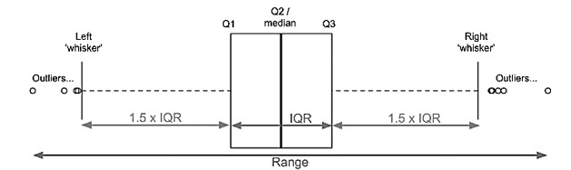

::: {style="float:left;position:absolute;top:0px;margin-top:10px;"}
{width="300"}
:::

```{r include=FALSE}
source(file = here::here("libraries.R"))
```

```{r, message = F, warning = F, include=FALSE}
penguins <- palmerpenguins::penguins %>% 
  janitor::clean_names()

dim_penguins <- dim(penguins)
n_rows <- nrow(penguins)
n_col  <- ncol(penguins)

n_rows
n_col

dim_penguins[[1]]
dim_penguins[[2]]
```

<br> <br> <br> <br>

# 1. Exploratory analysis

::: {style="float:left;"}
We are interested in how **bill length** differs between the three species of penguin (Adelie, Chinstrap & Gentoo) of penguins dataset from the 'palmer penguins' package.
:::

```{r warning=FALSE, echo=FALSE, message=FALSE}

variables_info <- data.frame(
  sapply(penguins,class)
  )

# Move rownames for a variable called 'variable';
# Rownames numerated from 1 to nr of rows
variables_info$varibale <- rownames(variables_info)
rownames(variables_info) <- 1:nrow(variables_info)
variables_info <- variables_info %>% relocate(varibale)


#edit table
kable(
    x = variables_info,
    col.names = c("Variable","Type"),
    align = "c"
  ) %>% 
  kable_styling(
    full_width = FALSE,
    position = "float_right",
    bootstrap_options = c("striped", "responsive"),
    stripe_color = "#FFF2CC") %>% 
  add_footnote(
    label = c("List of names and variable type"), 
    escape = FALSE,
    notation = "none") %>%
  row_spec(0, background = "#B3E0FF", color = "#333333") %>%
  row_spec(1:nrow(variables_info), extra_css = "border-bottom: 1px solid #DCEFFB")

```

```{r warning=FALSE, echo=FALSE, message=FALSE}

#https://cran.r-project.org/web/packages/skimr/vignettes/skimr.html

penguins %>% 
  group_by(species) %>% 
  skim(bill_length_mm) %>% 
  yank("numeric") 


```

Boxplot Analysis

A boxplot is a useful way to look at the distribution of our data. By specie, will be done a preview analysis to know how bill length is distributed.

###  {.tabset}

#### Bill length distribution

```{r}
box_plot_description <- c("bill length distribution symetric and no outliers",
                          
                          "asymmetric distribution - negatively skewed (skewed left).

1.  **median position:** the median value is not centered on the IQR, but shifted to the right. It is visible by the scale of bill length, where from Q1 to Q2 the difference is about 3 mm, and between Q2 and Q3 is less than 1 mm.
2.  **whisker:** in a left-skewed, is expected that the whisker is shorter on the upper end of the box than the lower end. However in this case it is not verified once that the upper whisker has a length of 7mm (from 51mm to 58mm) and the other hand the the lower whisker has a length of 5.5mm (from 41mm to 46.5mm, approximated values);
3.  **outliers:** All values are between the upper and lower whisker which means that there are no outliers. However, some values seem isolated and far away from the most distribution of values, like values above 55mm. The fact that the upper whisker is higher than lower, is the reverse that would be expected to influence this isolate value.",

"ooooooooooooooooooooo"
                          
                          
                          )
```

```{r warning=FALSE, echo=FALSE, message=FALSE, out.width="100%"}
penguins_boxplot <- penguins %>% 
  drop_na(bill_length_mm) %>% 
  group_by(species) %>% 
  ggplot() +
  aes(x = bill_length_mm, y = 1) +
  geom_boxplot(outlier.colour = NA) +
  geom_point(position = position_jitter(height = .2), alpha = .5, aes(color = species)) +
  labs(
    # title = "Bill length (mm) by penguin species",
    x     = NULL,
    y     = NULL) + 
  scale_x_continuous(breaks = seq(25, 60, 1)) +
  scale_color_manual(values = c("Adelie" = "#FF7B01", "Chinstrap" = "#C35BCA", "Gentoo" = "#0E7470")) +
  theme_minimal() +
  theme(
    #strip.text       = element_text(face = "bold", color = "black"),
    axis.text.y      = element_blank(),
    panel.grid.major.y = element_blank(),
    panel.grid.minor.y = element_blank(),
    panel.grid.minor.x = element_blank(),
    panel.background = element_rect(fill = "#FFFCF5", color = "#FFFCF5"),
    plot.background = element_rect(fill = "#FFFCF5", color = "#FFFCF5"),
    panel.border = element_blank(),
    axis.line = element_blank(),
    legend.position = "none"
  )

# Apply different strip backgrounds using facet_theme from ggh4x
# https://teunbrand.github.io/ggh4x/articles/Facets.html
penguins_boxplot + ggh4x::facet_wrap2(
  ~species,  scales = "free", nrow = 3,
  labeller = labeller(group = as_labeller(box_plot_description)),
  strip = strip_themed(
    # background_x = elem_list_rect(fill = c("#FF7B01", "#C35BCA", "#0E7470")),
    text_x = elem_list_text(colour = c("black", "black", "black"))
    )
  )

```

<div style="background-color:#F5F2EB; border:0.1px solid #F5F2EB; padding:15px">

<p style="text-align:center; font-weight:bold; font-size:30px; color: #0E7470;margin-top:5px">

Analysis

</p>

**Adelie:** bill length distribution symetric and no outliers.

<hr style="border:1px solid">

**Chinstrap:** asymmetric distribution - negatively skewed (skewed left).

1.  **median position:** the median value is not centered on the IQR, but shifted to the right. It is visible by the scale of bill length, where from Q1 to Q2 the difference is about 3 mm, and between Q2 and Q3 is less than 1 mm.
2.  **whisker:** in a left-skewed, is expected that the whisker is shorter on the upper end of the box than the lower end. However in this case it is not verified once that the upper whisker has a length of 7mm (from 51mm to 58mm) and the other hand the the lower whisker has a length of 5.5mm (from 41mm to 46.5mm, approximated values);
3.  **outliers:** All values are between the upper and lower whisker which means that there are no outliers. However, some values seem isolated and far away from the most distribution of values, like values above 55mm. The fact that the upper whisker is higher than lower, is the reverse that would be expected to influence this isolate value.

<hr style="border:1px solid">

**Gentoo[:]{.smallcaps}** the distribution is positively skewed (skewed right).

1.  **median position:** Although not accentuated, the median value is not centered on the IQR, but slight shifted to the left;
2.  **whisker:** as expected in an positively skewed, the whisker is shorter on the lower end of the box;
3.  **outliers:** It is visible that are outliers. There is at least one value beyond the upper whisker.

</div>

**Numeric Information from bloxpots:**

```{r}
# A futher understanding of bloxplot teel us in number.
bloxpot_summary <- as_tibble(penguins %>% 
  group_by(species) %>% 
  summarise(
    #Q1: the value splitting the distribution into a lower 25% and higher 75%.
    #Q2: the value splitting the distribution into a lower 50% and higher 50%.
    #Q3: the value splitting the distribution into a lower 75% and higher 25%.
    #IRQ: Interquartile range is the range in which 50% of the values fall
    Q1 = quantile(bill_length_mm, 0.25, na.rm = TRUE),
    Q2 = quantile(bill_length_mm, 0.5, na.rm = TRUE),
    Q3 = quantile(bill_length_mm, 0.75, na.rm = TRUE),
    IRQ = Q3 - Q1,  #or IRQ = IRQ(bill_length_mm)
    
    lower_whisker = Q1 - 1.5 * IRQ,
    upper_whisker = Q3 + 1.5 * IRQ,
    
    # how many values are beyond upper and lower whisker - potential outliers
    nr_outlier_upper  = sum(bill_length_mm > upper_whisker, 
                               na.rm = TRUE),
    nr_outlier_lower = sum(bill_length_mm < lower_whisker,
                               na.rm = TRUE)
    ))

bloxpot_summary
```

-   **IRQ:** 50% of values are concentrated in a range of 4mm for Adelie, 4.725 mm for Chinstrap and 4.250 mm for Gentoo.
-   **number of potential outliers:** Just for Gentoo specie apparently there is an unique outlier.

#### Auxiliar: Boxplot interpretation

The central box in bloxpot correspond to the interquartile range of data distribution (IQR), which means that 50% of values are falling between the Q1 and Q3. Values beyond the whiskers on both sides are normally considered as outliers.



The bar inside the central box represents the median (Q2) and show the symmetry and skewness of the data. The skewness refers to distortion or asymmetry in a normal distribution in a dataset.

-   **symmetric distribution**, The median is in the middle of the box, and the lengths of the whiskers are about the same on both sides;

-   **distribution is positively skewed (skewed right)**, The median is closer to the bottom of the box (Q1), the whisker is shorter on the lower end of the box.

-   **distribution is negatively skewed (skewed left)**, The median is closes to the top of the box and the whisker is shorter on the upper end of the box.

    

###  {.unnumbered}

**To meet the ouliers by standardized variable / z-score or a standard score.**

```{r}
# Standardised variable z

  # find out how far away from the mean we are (center the distribution) in units 
  # of the standard deviation of the distribution.

  # z-scores can be used to define values that are outliers - a typical 
  # definitions any data point that lies above or below three standard  
  # deviations from the mean.
bill_length_z_score <- penguins %>%
  group_by(species) %>% 
  summarise(z_score = scale(bill_length_mm)) #'scale()' to get z-scores value

bill_length_z_score

#outliers based upon z-scores beyond z = ± 3
bill_length_z_score %>%
  filter(!between(z_score, left = -3, right = 3))
```

There is an outlier as expected in the Gentoo specie.

<br>

<hr>

# 2. Summary statistics

##  {.tabset}

### Summary Statistics Analysis

```{r message = F, warning = F, include=FALSE}
# Function that allow to classify the magnitude of the skewness
# Output of this function is used in a summarise bellow where other statistics 
# values were calculated too.
magnitude_skewness_classification <- function(skewness_value){
  if(abs(skewness_value) < 0.5) {
    return("fairly symmetrical")
  }
  
  if(between(abs(skewness_value), 0.5, 1.0)) {
    return("moderately skewed")
  }
  
  if(abs(skewness_value) > 1.0) {
    return("highly skewed")
  }
}
```

```{r warning=FALSE, echo=FALSE, message=FALSE}
summary_statistics <- penguins %>% 
  drop_na() %>% 
  group_by(species) %>% 
  summarise(mean_bill_length     = round(mean(bill_length_mm), digits = 3),
            median_bill_length   = round(median(bill_length_mm), digits = 3),
            sd_bill_length       = round(sd(bill_length_mm), digits = 3),
            skewness_bill_length = round(skewness(bill_length_mm, 
                                            type = 1), digits = 3),
            magnitude_skewness_classification = 
              magnitude_skewness_classification(skewness_bill_length)
  )

summary_statistics %>% 
  kable(
    align = "c",
    col.names = c("Species", "Mean", "Median", "sd", "Skewness", "Skewness Classification")
  ) %>% 
  kable_styling(
    full_width = TRUE,
    position = "center",
    bootstrap_options = c("basic", "responsive")) %>% 
  add_footnote(notation = "none", label = "Penguins Bill Length Summary Statistics") %>% 
  row_spec(0, background = "#FFF2CC", color = "black", extra_css = "border-bottom:0px solid red") %>% 
  row_spec(1:3, extra_css = "border-bottom:1px solid black")
```

***mean vs median*** The mean is more heavily swayed by outliers than the median. Looking for the results obtained, there are a relatively small difference between the mean and median values per specie in bill_length_mm variable, what take us to think that the number of outliers are relatively small or even non-existent.

**Skewness**

-   **Adelie:** skewness = 0.156, then the distribution of values in relation of asymmetry tends to be distorted the right. As the absolute skewness value is less than 0.5, the classification of skewness magnitude is classified as fairly symmetrical.
-   **Chinstrap:** skewness = -0.089, then tends to be distorted the left. Absolute value (=0.089) is less than 0.5 then the in relation to the magnitude is classified as fairly symmetrical. Mean value is lower than median as expected for centrality measures in a left skewness.
-   **Gentoo:** skewness = 0.604, then tends to be distorted the right. About the magnitude is classified as moderately skewed once the absolute value (=0.604) is between 0.5 and 1.

**Standard deviation** (sd)

-   **Adelie:** is expected that 68% of values are between 36.161 (mean - sd) and 41.487 (mean + sd);
-   **Chinstrap:** is expected that 68% of values are between 45.495 and 52.173.
-   **Gentoo:** expected that 68% of values are between 44.462 and 50.674.

### Auxiliar: Concepts

::: {style="float:left;"}
**The Skewness** in a distribution refers to its asymmetry, indicating a tendency to be distorted either to the left (negative value, where centrality measures typically fall in the order mean \< median \< mode) or to the right (positive value, where measures fall in the order mode \< median \< mean). The magnitude of skewness is determined by the absolute value of skewness.
:::

```{r warning=FALSE, echo=FALSE, message=FALSE}
Skewness <- data.frame(
  range = c("< 0.5", "0.5 - 1.0", "> 1.0"),
  skewness_magnitude = c("fairly symmetrical", "moderately skewed", "highly skewed")
)

Skewness %>% 
  kable(
    x = .,
    col.names = c("Range", "Skewness magnitude"),
    align = "c"
  ) %>% 
  kable_styling(
    full_width = FALSE,
    position = "right",
    bootstrap_options = c("basic", "responsive")) %>% 
  row_spec(0, background = "none", color = "black") %>% 
  row_spec(1, background = "#FFBEC7", color = "black") %>% 
  row_spec(2, background = "#FFF0D0", color = "black") %>% 
  row_spec(3, background = "#B6E5BC", color = "black")
  
  
```

**The standard deviation (sd)** is a measure indicating the average amount by which values in a distribution deviate from the mean. It provides insight into the dispersion of observations within the distribution. In the case of a normal distribution, it is expected that:

```{r warning=FALSE, echo=FALSE, message=FALSE}
sd_range <- data.frame(
  range = c("68% of values fall within one standard deviation of the mean",
            "95% for two standard deviation",
            "99.7% for 3 standard deviation"))

sd_range %>% 
  kable(
    x = .,
    col.names = ""
  ) %>% 
  row_spec(0:3, extra_css = "border-bottom: 1px solid grey; padding:10px 0px" )
  
```

<hr>

# 3. Hypothesis test & Probability

Perform a hypothesis test to check whether the mean bill length of Gentoo is significantly longer than the mean bill length of Adelie.

**H0:** The average of bill length of gentoo specie is the same of the average of adelie specie. $$
H_0: \mu_{average \ gentoo \ bill \ length} - \mu_{average \ adelie \ bill \ length} = 0
$$

**H1:** The average of bill length of gentoo specie is longer than the average of adeleie specie.

$$
H_1: \mu_{average \ gentoo \ bill \ length} -\mu_{average \ adelie \ bill \ length} > 0
$$

##  {.tabset}

### Hypothesis test

```{r message = F, warning = F, include=FALSE}

#  -------------------------------------------------------------------------------
# Define the significance level and calculate null distribution, observed statistic and p-value.
# --------------------------------------------------------------------------------

# decide significnce level (a)
a <- 0.05


# null sample distribution

null_distribution <- penguins %>%
  filter(species %in% c("Gentoo", "Adelie")) %>%
  specify(bill_length_mm ~ species) %>%
  hypothesize(null = "independence") %>%
  generate(reps = 10000, type = "permute") %>%
  calculate(stat = "diff in means", order = c("Gentoo", "Adelie"))


# observed statistic
obs_statistic <- penguins %>%
  filter(species %in% c("Gentoo", "Adelie")) %>%
  specify(bill_length_mm ~ species) %>%
  calculate(stat = "diff in means", order = c("Gentoo", "Adelie"))

obs_statistic 

# p-value
  # An one-tailed test
null_distribution %>%
  get_p_value(direction = "right", obs_stat = obs_statistic)
```

```{r warning=FALSE, echo=FALSE, message=FALSE, out.width="100%"}

# --------------------------------------------------------------------
# Visualize the p-value on the null distribution:
# --------------------------------------------------------------------

null_distribution %>%
  visualise() +
  shade_p_value(direction = "right", obs_stat = obs_statistic) + 
  theme_minimal() +
  labs(title = "Visualize the p-value on the null distribution") +
  scale_x_continuous(breaks = seq(-3, 10, 1)) +
  theme(panel.grid.minor.y = element_blank(),
        panel.grid.minor.x = element_blank(),
        panel.background = element_rect(fill = "#FFFCF5", color = "#FFFCF5"),
        plot.background = element_rect(fill = "#FFFCF5", color = "#FFFCF5"))

round(max(null_distribution$stat), digits = 3)
round(min(null_distribution$stat), digits = 3)
```

::: {style="background-color:#F5F2EB; border:0.1px solid #F5F2EB; padding:15px"}
<p style="text-align:center; font-weight:bold; font-size:30px; color: #0E7470;margin-top:5px">

Analysis

</p>

**Conclusions:** The visualization shows that the observed statistic (8.713487) is beyond our null distribution (representation of a sampling distribution of H0). With the observed statistic value far from any tail side of the null distribution, it means that there is no probability of getting a value under the null distribution, and this way we reject H0.

A type I error (false positive) is the probability of rejecting the null hypothesis when the null hypothesis is not false. It means that are a 5% (significance level equal to 0,05) of probability rejecting the hypothesis that the difference of the means of the bill length by species is equal, being this hypothesis true.

The p-value is lower than the significance level (0.05), so there is strong evidence to reject H0 in favour of H1. Therefore, there is strong evidence that the average of bill length the Gentoo specie is longer than the average of the Adelie specie.
:::

### Auxiliary: Theory concepts

**Significance level**: is a pre-determined threshold for the p-value determining whether we reject H0 or not. The significance level defines Type I error, which is the probability of rejecting the null hypothesis when the null hypothesis is true.

**Null distribution**: is a sampling distribution, typically generated using bootstrap methods, representing what one would expect if the null hypothesis (H0) were true. In essence, H0 is employed to simulate this null sampling distribution.

**p-value**: signifies the probability of observing a test statistic as extreme as, or more extreme than, the obtained value, assuming the null hypothesis is true. It serves as the smallest significance level at which we would reject the null hypothesis, considering the observed sample statistic.

##  {.unnumbered}

<br>

<hr>

# 4. Correlation Analysis

##  {.tabset}

### Correlation Matrix

```{r warning=FALSE, echo=FALSE, message=FALSE, out.width="80%"}

r_plot <- penguins %>% 
  select(-year) %>% 
  ggcorr(label = TRUE, 
         geom        = "tile",
         label_size  = 4,
         label_round = 2,
         label_color = "black")

r_plot + 
  theme(panel.background = element_rect(fill = "#FFFCF5")) +
  theme(plot.background = element_rect(fill = "#FFFCF5"))

```

::: {style="background-color:#F5F2EB; border:0.1px solid #F5F2EB; padding:15px"}
<p style="text-align:center; font-weight:bold; font-size:30px; color: #0E7470;margin-top:5px">

Analysis

</p>

The length of the penguins bill has a negative weak correlation with the depth of the bill (r = -0.24), and a strong positive and strong correlation with the length of the flipper (r = 0.66) and the weight (r = 0.6).

Therefore, with a weak dependency (weak linear relationship), it is not reasonable to make predictions of the penguing's bill length through the bill depth.

On the other hand, we could look by the length of the flipper and the weight to predict the length of the penguin's bill, once both physical characteristics have a strong linear relationship with the bill´s length, reveling dependency from each other.
:::

### **Auxiliary: Theory concepts**

The correlation provides both the **direction** and the **strength** of a linear relationship between two variables. The direction could be negative or positive and the strength is measured by the correlation coefficient (r) limited from -1 to +1.

How much closer the correlation coefficient (r) is to 1, stronger would be the linear relationship between two variables. Intermediate values indicate that variables tend to be related.

-   **Null Correlation:** a correlation equal to 0 indicates no linear relationship between the two variables; the variables are independent.
-   **Positive Correlation:** with a correlation of +1 the two random variables have a perfect positive linear relationship, therefore, a specific value of one variable, X, predicts the other variable, Y, exactly. The variables are positively dependent.
-   **Negative Correlation:** a correlation of -1 indicates a perfect negative linear relationship between two variables, with one variable, X, predicting the negative of the other variable, Y. Perfect negative linear dependency is indicated by a correlation of -1.

The magnitude to classify the strength of the correlation between variables is shown in the following table:

```{r warning=FALSE, echo=FALSE, message=FALSE}

correlation <- data.frame(
  magnitude_rxy        = c("0", "0.01 - 0.19", "0.20 - 0.39", "0.40 - 0.59", 
                           "0.60 - 0.79", "0.80 - 0.99", "1"),
  strength_correlation = c("none", "very weak", "weak", "moderate",
                           "strong", "very strong", "perfect")
)
correlation %>% 
  kable(
    x = .,
    align = "c",
    col.names = c("Magnitude r(x, y)", "Correlation Strength")
  ) %>% 
  kable_styling(
    full_width = FALSE,
    position = "center",
    bootstrap_options = c("basic", "responsive")) %>% 
  row_spec(0, background = "#FFF2CC", color = "black") 
```

##  {.unnumbered}
